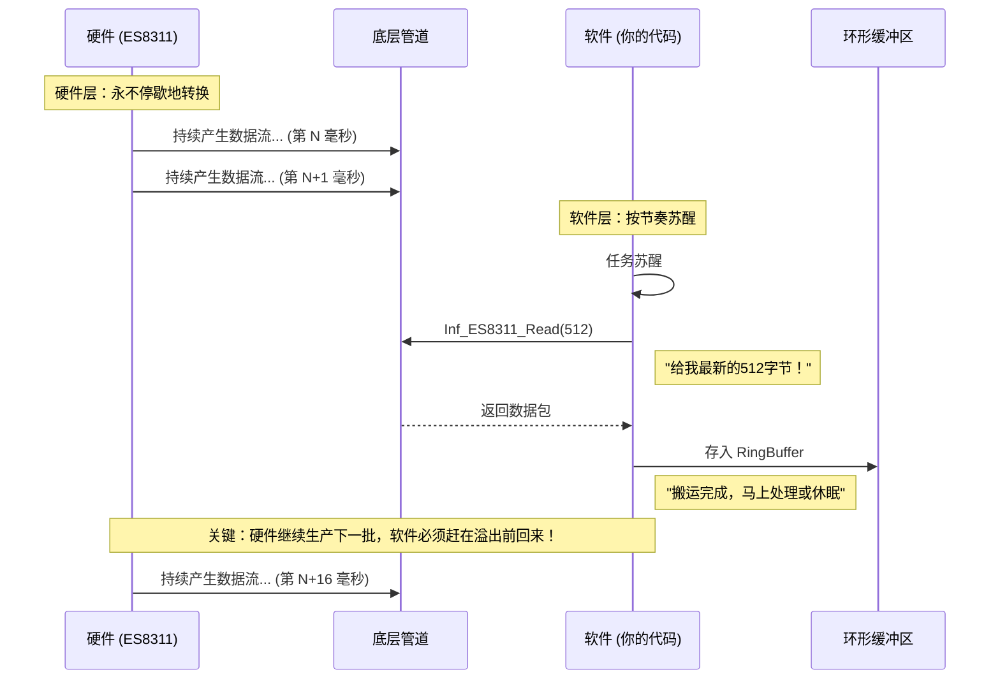

# 嵌入式音频开发笔记:ES8311

# ADC流式处理与缓冲区机制

## 1. 核心概念总结
在嵌入式音频系统（如 ESP32 + ES8311）中，硬件与软件是**并行工作**的。

* **硬件层 (ES8311)**：**Continuous (连续流)**。ADC 像一个永不关闭的水龙头，根据采样率（如 16kHz）源源不断地产生数据。它不等待，不暂停。
* **软件层 (Firmware)**：**Batch Processing (分批处理)**。CPU 无法做到“来一个字节处理一个”，而是每隔一小段时间（如 0.016s），去硬件底层“搬运”一批数据。

## 2. 关键参数解析

在代码 `Inf_ES8311_Read(datas, 512)` 中：

* **512 (Bytes)**：**搬运的批量大小 (Chunk Size)**。
    * 这是软件一次性从底层 FIFO/DMA 获取的数据量。
    * 它不是硬件的工作上限，而是软件为了平衡“实时性”与“CPU效率”设定的一个容器大小。
* **0.016s (16ms)**：**时间切片**。
    * 计算公式：$512 \text{ Bytes} \div (16000 \text{ Hz} \times 2 \text{ Bytes/Sample}) = 16 \text{ ms}$
    * 意味着软件必须每 16ms 苏醒一次来搬运数据，否则底层缓冲区会溢出 (Overflow)。

## 3. 形象比喻：生产流水线

* **麦克风**：原料入口（源源不断）。
* **ES8311**：打包机器（24小时无休工作）。
* **512字节数组**：搬运工手里的**箱子**。
* **读取函数**：搬运工走过去装满箱子，然后倒进仓库（RingBuffer）的动作。

> **误区纠正**：ES8311 不是工作 0.016s 就停下来休息。它一直在工作，512 只是我们把它**过去** 0.016s 产出的数据一次性取走。

## 4. 运行时序图 (Mermaid)




      
```c
 
 uint8_t datas[512]; // 准备一个“箱子”

while(1) 
{
    // 1. 搬运：去底层截取最新的 512 字节（耗时 16ms 积攒的量）
    if( Inf_ES8311_Read(datas, 512) == OK )
    {
 // 2. 入库：倒进大水池，防止丢失
    RingBuffer_Write(datas, 512); 
    
    // 3. 消费：发送给云端或进行语音识别
	}
// 注意：这里的处理逻辑不能阻塞太久，必须赶在下一个 16ms 到来前回去继续 Read
}
```
