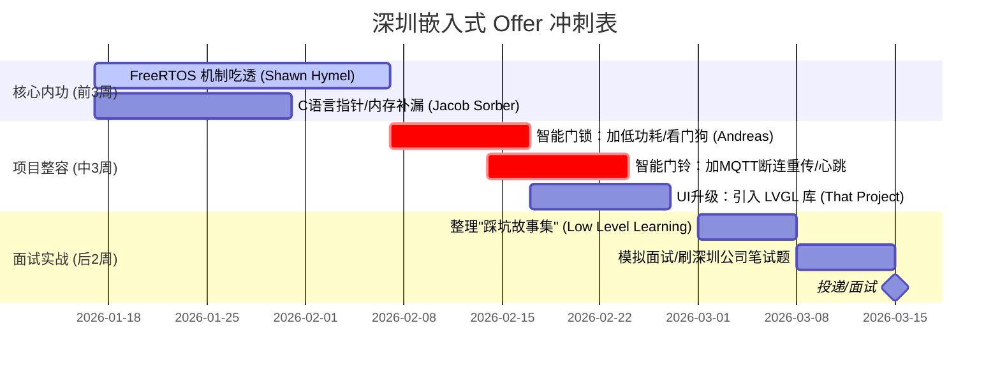

# ⚔️ 深圳嵌入式求职最终作战计划：AIoT 3年经验速成版

> **目标**：在2个月内，将“培训班项目”迭代为“商业级产品”，通过技术面试，拿下深圳 AIoT/智能硬件 Offer。
> **核心策略**：**重深度、轻广度**。不学屠龙技（CPU造机），只练杀人技（RTOS调试、低功耗、网络保活）。
> **适用命格**：丁火（专注逻辑与交互美学）+ 深圳（搞钱务实派）

---

## 📅 阶段一：筑基·操作系统与并发 (面试必问)
**现状痛点**：培训班代码通常是“裸机思维”或简单的 `xTaskCreate`，经不起深问。
**3年经验标准**：必须懂**任务通信**、**资源竞争**和**系统调试**。

| 资源名称                             | 必看内容/关键词                                              | 你的行动 (Action Item)                                       | 面试核心话术 (背诵)                                          |
| :----------------------------------- | :----------------------------------------------------------- | :----------------------------------------------------------- | :----------------------------------------------------------- |
| **Shawn Hymel** *(Digi-Key 官方)* | `Introduction to RTOS` *(重点看 Mutex, Semaphore, Queue)* | **下载代码跑一遍**： 用 LED 翻转模拟任务，亲眼看懂什么是“任务抢占”。 | “我之前的项目中，为了解决串口数据处理过慢的问题，我用**队列 (Queue)** 配合**DMA中断**做了解耦，防止任务阻塞。” |
| **Shawn Hymel**                      | `Priority Inversion` *(优先级反转)*                       | **制造 Bug**： 故意写一个优先级反转的代码，导致系统卡死，然后用 `Mutex` 修复它。 | “我遇到过高优先级任务被低优先级卡死的情况，后来发现是互斥锁使用不当，我启用了 FreeRTOS 的**优先级继承**机制解决了。” |
| **Fastbit** *(仅作字典查阅)*      | `FreeRTOS Debugging`                                         | **学会看堆栈**： 当系统 Crash 时，怎么看是哪个 Task 栈溢出了。 | “我们在量产前会做压力测试，通过 `uxTaskGetStackHighWaterMark` 监控每个任务的**剩余栈空间**。” |

---

## 🔋 阶段二：镀金·产品化改造 (核心竞争力)
**现状痛点**：你的门铃/门锁只要能跑就行，不管耗电，不管断网。
**3年经验标准**：**低功耗 (Low Power)** 和 **稳定性 (Reliability)** 是量产产品的灵魂。

| 资源名称                            | 必看内容/关键词                         | 你的行动 (Action Item)                                       | 面试核心话术 (背诵)                                          |
| :---------------------------------- | :-------------------------------------- | :----------------------------------------------------------- | :----------------------------------------------------------- |
| **Andreas Spiess** *(瑞士老哥)*  | `ESP32 Deep Sleep` `ULP Coprocessor` | **门锁项目改造**： 加入休眠逻辑。门锁平时必须休眠，只有按键/指纹才唤醒。 | “为了延长门锁续航，我使用了 ESP32 的 **Deep Sleep** 模式，将待机电流压到了 **10uA** 左右，只保留 RTC 唤醒。” |
| **Andreas Spiess**                  | `MQTT Reliability` `Last Will`       | **门铃项目改造**： 拔掉路由器，看你的设备会不会自动重连？如果不会，就是不及格。 | “针对弱网环境，我设计了**应用层心跳**机制，并利用 MQTT 的 **Last Will (遗嘱)** 功能，让服务器能瞬间感知设备离线。” |
| **Controllerstech** *(印度小哥)* | `STM32 Watchdog`                        | **全项目标配**： 给所有项目加上**独立看门狗 (IWDG)**。    | “嵌入式设备必须考虑死机复位，我在主循环里喂狗，防止程序跑飞。” |

---

## 🎨 阶段三：绝杀·交互与审美 (丁火优势)
**现状痛点**：传统嵌入式工程师做的界面像 90 年代的机顶盒。
**3年经验标准**：现在消费电子（如带屏智能音箱、旋钮屏）对 UI 要求极高。

| 资源名称         | 必看内容/关键词                     | 你的行动 (Action Item)                                       | 竞争优势                                                     |
| :--------------- | :---------------------------------- | :----------------------------------------------------------- | :----------------------------------------------------------- |
| **That Project** | `ESP32 LVGL` `SquareLine Studio` | **界面重构**： 把你门铃或门锁的简单的 OLED 菜单，换成 **LVGL** 写的高帧率彩色界面（哪怕只是几个图标滑动）。 | **降维打击**： 大多数纯底层工程师不会写好看的 UI。你拿出作品视频一放，面试官眼前一亮：“这人有产品思维！” |

---

## 🧱 阶段四：护城河·C语言内功 (笔试防挂)
**现状痛点**：能干活，但基础题（指针、内存）容易扣分。

| 资源名称               | 必看内容/关键词              | 重点突破点                                                   |
| :--------------------- | :--------------------------- | :----------------------------------------------------------- |
| **Jacob Sorber**       | `Pointers`, `Struct Padding` | **结构体对齐**：通信协议里字节错位了怎么办？`__attribute__((packed))` 是什么意思？ |
| **Low Level Learning** | `Volatile`, `Interrupts`     | **Volatile**：为什么中断里修改的全局变量必须加 `volatile`？（答不上来直接挂） |

---

## 🗓️ 2个月冲刺甘特图 (Execution Plan)

