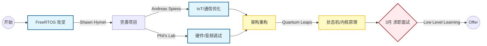

# 📺 嵌入式开发 YouTube 优质学习资源汇总

> **更新时间**：2026-01-16
> **适用阶段**：进阶提升 / 面试准备 / 架构思维构建
> **核心目标**：构建国际化技术视野，提升代码规范与底层理解

## 📋 快速索引表

| 频道名称                       | 核心领域              | 难度  | 推荐理由 (针对当前技术栈)                    |
| :----------------------------- | :-------------------- | :---- | :------------------------------------------- |
| **Shawn Hymel** (Digi-Key)     | **RTOS**, ESP32       | ⭐⭐⭐   | 全网最好的 FreeRTOS 教程，解决多任务同步难题 |
| **Quantum Leaps** (Miro Samek) | **状态机**, ARM内核   | ⭐⭐⭐⭐⭐ | 深入理解 Event-Driven 架构，从汇编级看中断   |
| **Phil's Lab**                 | STM32, PCB, DSP       | ⭐⭐⭐⭐  | 学习专业工程规范，音频处理 (ES8311) 参考     |
| **Andreas Spiess**             | IoT, **MQTT**, 传感器 | ⭐⭐⭐   | 开阔选型思路，低功耗与通信协议实测           |
| **Low Level Learning**         | C语言底层, 职场       | ⭐⭐    | 巩固 C 指针/内存管理，面试技巧准备           |

---

## 🔍 详细介绍

### 1. 基础与架构：Quantum Leaps (Miro Samek)
* **必看系列**：`Modern Embedded Systems Programming`
* **核心价值**：
    * **状态机 (State Machine)**：他是 QP 框架作者，对理解复杂的业务逻辑跳转（如你项目中的 `GlobalVars` 状态流转）极有帮助。
    * **底层原理**：深入讲解 ARM Cortex-M 寄存器、堆栈、中断现场保护，是面试中回答“底层原理”问题的素材库。

### 2. RTOS 最佳导师：Shawn Hymel
* **必看系列**：`Introduction to RTOS` (基于 ESP32/STM32)
* **核心价值**：
    * **可视化教学**：使用示波器展示任务切换耗时，非常直观。
    * **对口技术**：涵盖 **FreeRTOS** 的队列 (Queue)、互斥量 (Mutex)、信号量 (Semaphore)，代码风格极佳，适合直接模仿。
    * **英语听力**：发音标准，适合作为磨耳朵的材料。

### 3. 硬核工程实战：Phil's Lab
* **必看系列**：STM32 高级教程, KiCad PCB 设计
* **核心价值**：
    * **全栈能力**：展示从原理图设计到固件编写的全过程。
    * **高级应用**：包含 **DSP (数字信号处理)**、滤波器设计、音频处理，对理解音频编解码芯片（如 ES8311）有帮助。

### 4. ESP32 极客教父：Andreas Spiess
* **必看系列**：ESP32 评测, MQTT 稳定性测试
* **核心价值**：
    * **IoT 通信**：大量关于 **MQTT**, HTTP, LoRa 的实测数据，适合解决“连接不稳定”类问题。
    * **方案选型**：评测各种新奇传感器和模块，为个人项目提供灵感。

### 5. 职业与底层：Low Level Learning
* **必看系列**：C 语言陷阱, 嵌入式面试指南
* **核心价值**：
    * **避坑指南**：深挖 C 语言内存泄漏、指针滥用等经典错误。
    * **求职准备**：提供很多关于如何写简历、如何应对技术面试的实操建议。

---

## 🗺️ 建议学习路径 (Mermaid)

